# merge-squash

You are keeping notes on the cast of a sitcom you've started watching. Initially, you kept main cast and supporting cast on two separate branches.

Now you wish to keep everything in the `main` branch.

## Task

Squash-merge the `supporting` branch onto the `main` branch.

The result should look as follows:

```mermaid
gitGraph
    commit id: "Add Joey"
    commit id: "Add Phoebe"
    branch supporting
    checkout supporting
    commit id: "Add Mike"
    commit id: "Add Janice"
    checkout main
    commit id: "Add Ross"
    commit id: "[HEAD → main] ..."
```

